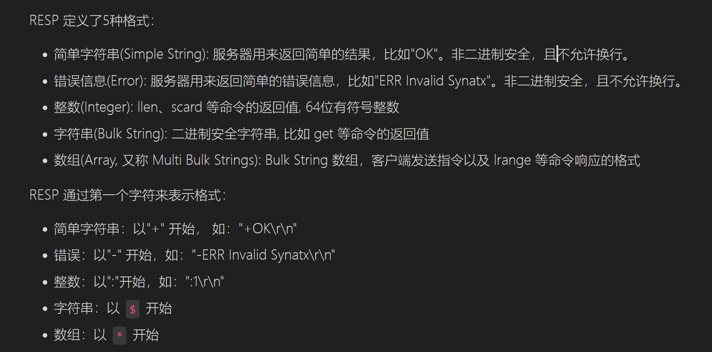
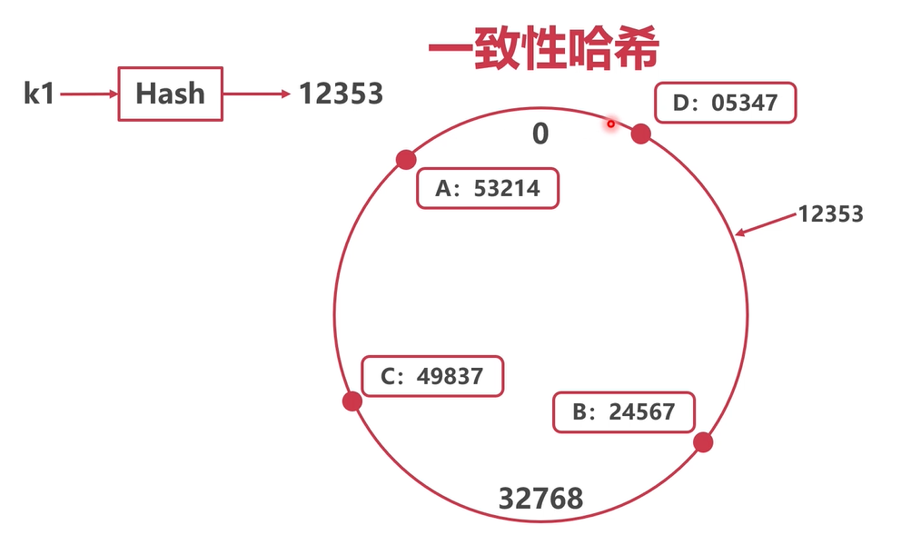
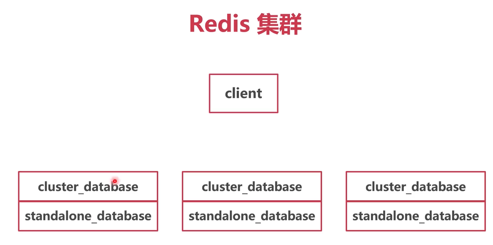

## 笔记

### tcp服务器

#### ```netpoller```

Golang 的 ```netpoller``` 基于IO多路复用和 goroutine scheduler 构建了一个简洁高性能的网络模型，并给开发者提供了 goroutine-per-connection 风格的极简接口。

#### 拆包与粘包问题

> TCP是个字节流协议，不存在粘包问题。

应用层协议通常采用下列几种思路之一来定义消息，以保证完整地进行读取:

- 定长消息
-  在消息尾部添加特殊分隔符，如项目中的[echo.go](tcp/echo.go)。bufio 标准库会缓存收到的数据直到遇到分隔符才会返回，它可以帮助我们正确地分割字节流。
- 将消息分为 header 和 body, 并在 header 中提供 body 总长度，这种分包方式被称为 LTV(length，type，value) 包。这是应用最广泛的策略，如HTTP协议。当从 header 中获得 body 长度后, io.ReadFull 函数会读取指定长度字节流，从而解析应用层消息。

#### 优雅关闭

在生产环境下需要保证TCP服务器关闭前完成必要的清理工作，包括将完成正在进行的数据传输，关闭TCP连接等。这种关闭模式称为优雅关闭，可以避免资源泄露以及客户端未收到完整数据导致故障。

TCP 服务器的优雅关闭模式通常为: 先关闭listener阻止新连接进入，然后遍历所有连接逐个进行关闭。

### resp协议和解析器

#### 定义

RESP 是一个二进制安全的文本协议，工作于 TCP 协议上。RESP 以行作为单位，客户端和服务器发送的命令或数据一律以 \r\n （CRLF）作为换行符。




### 内存数据库

sync.Map  
golang 官方提供的并发哈希表, 适合读多写少的场景。

#### key.go
- DEL
- EXISTS K1 K2 K3 ...
- FLUSHDB
- TYPE k1
- RENAME k1 k2 k1:v k2:v
- RENAMENX k1 k2

#### string.go

实现了5个指令
- GET k1
- SET k1 v
- SETNX k1 v1
- GETSET k1 v1
- STRLEN

### Redis持久化  

AOF 持久化是典型的异步任务，主协程(goroutine) 可以使用 channel 将数据发送到异步协程由异步协程执行持久化操作。

 > 把要写的aof条目塞入channel中，channel作为缓冲区，从channel中取出数据条目落在硬盘里面。

- NewAofHandler 
    - 初始化
- Add payload(set k v) -> aofChan
- handleAof payload(set k v) <- aofChan(落盘)
- LoadAof aof恢复

### Redis集群 






## 参考文献
- [Golang 实现 Redis(1): Golang 编写 Tcp 服务器](https://www.cnblogs.com/Finley/p/11070669.html)
- [Golang 实现 Redis(2): 实现 Redis 协议解析器](https://www.cnblogs.com/Finley/p/11923168.html)
- [Golang 实现 Redis(3): 实现内存数据库 ](https://www.cnblogs.com/Finley/p/12590718.html)
- [Golang 实现 Redis(4): AOF 持久化与AOF重写 ](https://www.cnblogs.com/Finley/p/12663636.html)
- [Golang 实现 Redis(7): 集群与一致性 Hash ](https://www.cnblogs.com/Finley/p/14038398.html)
- [Go 1.9 sync.Map揭秘 ](https://colobu.com/2017/07/11/dive-into-sync-Map/)